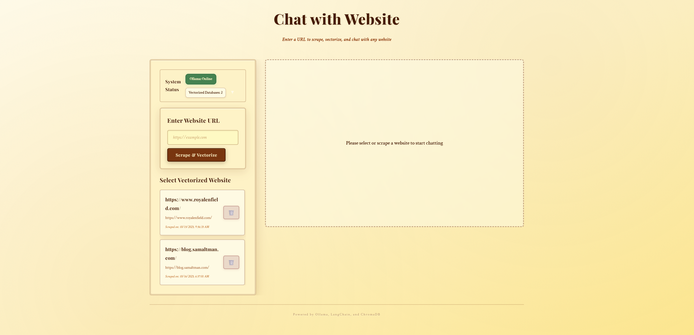

# Chat with Website - RAG System

## About

A Retrieval-Augmented Generation (RAG) system that allows users to chat with website content through a conversational interface. This system scrapes website content, vectorizes it, and enables natural language queries using local language models through Ollama.

## Features

- 🤖 **Local AI Processing**: Utilizes Ollama for privacy-focused language model processing
- 🔍 **Website Scraping**: Automatically scrapes and processes website content
- 💾 **Vector Database**: Stores website embeddings using ChromaDB for efficient retrieval
- 💬 **Conversational Interface**: Chat naturally with website content
- 📊 **Multiple Website Support**: Manage and query multiple vectorized websites
- 🔄 **RESTful API**: Clean API interface built with Django REST Framework
- ✅ **System Monitoring**: Built-in health checks and system information endpoints

## Tech Stack

**Backend:**
- Django & Django REST Framework
- Ollama (Local LLM)
- ChromaDB (Vector Database)
- Python

**Frontend:**
- React
- Axios
- React Markdown

**Data Storage:**
- PostgreSQL/SQLite (Metadata)
- ChromaDB (Vector Embeddings)
- CSV (Raw Content)

## Installation

### Prerequisites
- Python 3.8+
- Node.js 14+ and npm
- [Ollama](https://ollama.ai/) installed and running locally

### Backend Setup

1. **Clone the repository**
   ```bash
   git clone <repository-url>
   cd chat-bot-rag
   ```

2. **Create and activate virtual environment**
   ```bash
   python -m venv venv
   venv\Scripts\activate  # Windows
   # source venv/bin/activate  # Linux/Mac
   ```

3. **Install backend dependencies**
   ```bash
   cd backend
   pip install -r requirements.txt
   ```

4. **Run migrations**
   ```bash
   python manage.py migrate
   ```

5. **Start the backend server**
   ```bash
   python manage.py runserver
   ```

   Or use the provided batch script (from root directory):
   ```bash
   start_backend.bat
   ```

### Frontend Setup

1. **Install frontend dependencies**
   ```bash
   cd frontend
   npm install
   ```

2. **Start the frontend development server**
   ```bash
   npm start
   ```

   Or use the provided batch script (from root directory):
   ```bash
   start_frontend.bat
   ```

The frontend will automatically open at `http://localhost:3000` and connect to the backend at `http://localhost:8000`.

## Usage

### API Endpoints

| Endpoint | Method | Description | Parameters |
|----------|--------|-------------|------------|
| `/api/websites/` | GET | Lists all vectorized websites | None |
| `/api/websites/system_info/` | GET | Returns system information | None |
| `/api/websites/scrape/` | POST | Scrapes and vectorizes a website | `url`: Website URL |
| `/api/websites/chat/` | POST | Chats with vectorized content | `vector_db_id`: Database ID, `query`: User question |

### Example: Scrape a Website
```bash
curl -X POST http://localhost:8000/api/websites/scrape/ \
  -H "Content-Type: application/json" \
  -d '{"url": "https://example.com"}'
```

### Example: Chat with Website
```bash
curl -X POST http://localhost:8000/api/websites/chat/ \
  -H "Content-Type: application/json" \
  -d '{"vector_db_id": 1, "query": "What is this website about?"}'
```

### System Startup

On startup, the system automatically:
- ✅ Verifies Ollama availability and version
- 📋 Lists all vectorized databases
- 🌐 Displays available API endpoints

## Demo

### Interface Screenshot



### Video Demo


https://github.com/user-attachments/assets/cf213ec9-aa99-47da-bb80-ad10fe50d55f


> **Note:** To view the demo video, please see [demo/screen_recording/demo.mp4](demo/screen_recording/demo.mp4) in the repository.

## Contributing

Contributions are welcome! Please feel free to submit a Pull Request.

1. Fork the repository
2. Create your feature branch (`git checkout -b feature/AmazingFeature`)
3. Commit your changes (`git commit -m 'Add some AmazingFeature'`)
4. Push to the branch (`git push origin feature/AmazingFeature`)
5. Open a Pull Request

## License

This project is licensed under the MIT License - see the LICENSE file for details.

## Contact

**Project Maintainer:** Satyam

**Project Link:** [https://github.com/yourusername/chat-bot-rag](https://github.com/yourusername/chat-bot-rag)

---

Made using Django, Ollama, LangChain, and ChromaDB
